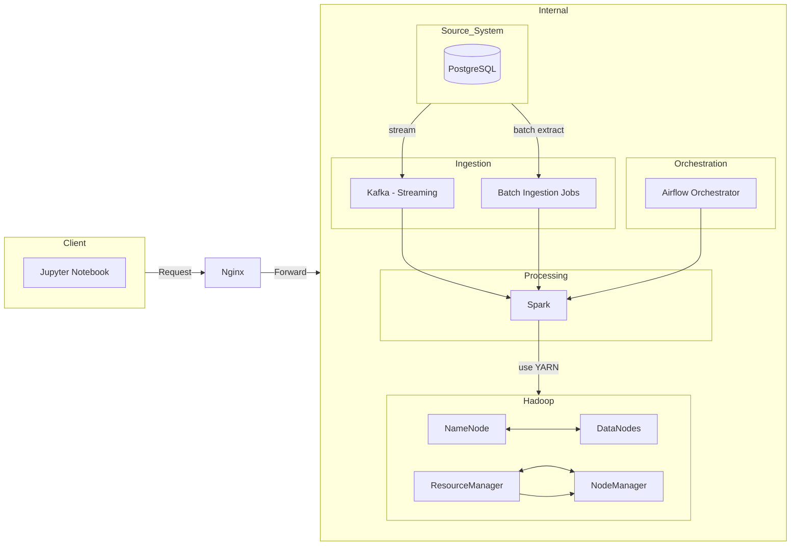

# Architecture (High Level, Simple)

```mermaid
flowchart LR
  subgraph Client
    NB[Jupyter Notebook]
  end

  subgraph Internal
    subgraph Source_System
      PG[(PostgreSQL)]
    end

    subgraph Ingestion
      Batch[Batch Ingestion Jobs]
      KF[Kafka - Streaming]
    end

    subgraph Orchestration
      AF[Airflow Orchestrator]
    end

    subgraph Processing
      SP[Spark]
    end

    subgraph Hadoop
      NN[NameNode] <--> DN[DataNodes]
      RM[ResourceManager] <--> NM[NodeManager]
    end
  end


  %% Flow
  Source_System -->|stream| KF
  Source_System -->|batch extract| Batch

  KF --> SP
  AF --> SP
  Batch --> SP

  SP -->|use YARN| Hadoop
  RM --> NM

  Client -->|Request| Nginx
  Nginx -->|Forward| Internal

```
