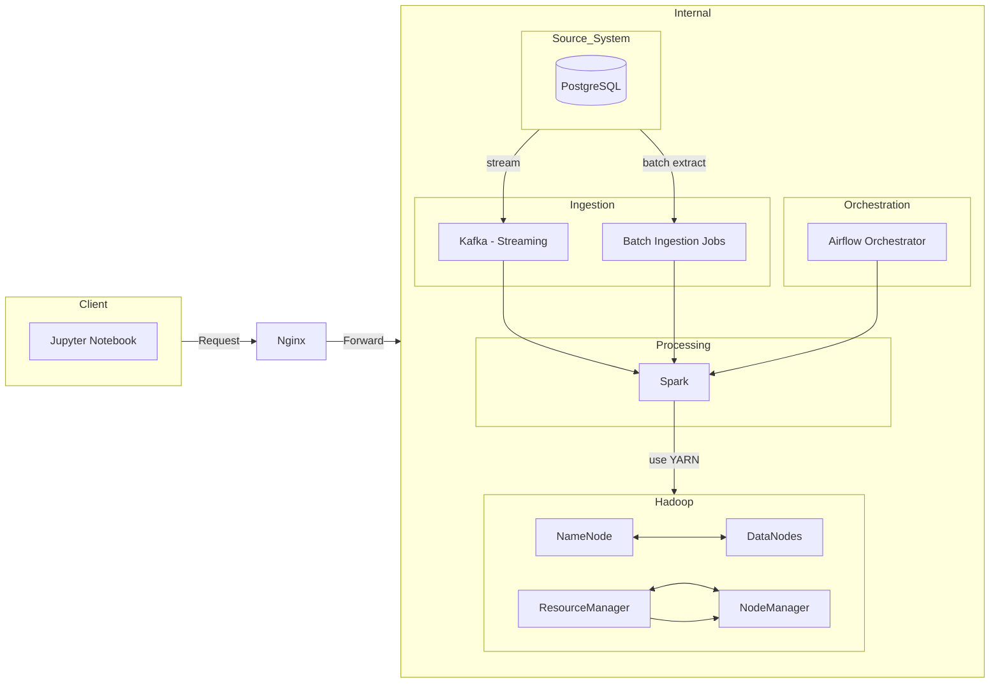

# Hadoop + Spark Multinode (Docker Compose)
This folder provides a Docker Compose setup for a Hadoop 3.3.6 multinode cluster with YARN, plus a local Spark 3.5.1 standalone cluster and a Jupyter notebook container for development.
# Architecture (High Level, Simple)



## Prerequisites
* Docker and Docker Compose
* 8+ GB RAM available for containers

## Quick Start
Run the provided script (recommended):

```bash
cd hadoop-environment
bash start-cluster.sh
```

Or run the steps manually:

```bash
cd hadoop-environment
docker network create hadoop_network
docker build -t hadoop-base:3.3.6 .
docker compose up -d
```

Stop the stack:

```bash
cd hadoop-environment
docker compose down
```

Remove volumes (destroys HDFS data):

```bash
cd hadoop-environment
docker compose down -v
```

## Services and Ports
* NameNode UI: `http://localhost:9870`
* ResourceManager UI: `http://localhost:8089`
* HistoryServer UI: `http://localhost:8188`
* NodeManager UI: `http://localhost:8042`
* DataNode UIs: `http://localhost:9864`, `http://localhost:9865`, `http://localhost:9866`
* Spark Master UI: `http://localhost:8090`
* Spark Worker UIs: `http://localhost:8091`, `http://localhost:8092`
* Spark Master RPC: `spark://localhost:7077`
* Jupyter: `http://localhost:8888`

## Iceberg Support
Iceberg runtime is preloaded in both `spark` and `airflow` images, using a Hadoop catalog on HDFS.

Environment variables in `.env`:
* `SPARK_ICEBERG_CATALOG` (default: `hadoop_catalog`)
* `SPARK_ICEBERG_WAREHOUSE` (default: `hdfs://namenode:8020/user/hive/warehouse`)
* `SPARK_ICEBERG_NAMESPACE` (default: `raw`)

To enable Iceberg write mode for ingestion jobs, set `ICEBERG_TABLE` before running DAG/task.  
Example: `ICEBERG_TABLE=clickstream`

Rebuild required images after this change:

```bash
docker compose build spark-master spark-worker-1 spark-worker-2 airflow-webserver airflow-scheduler airflow-worker airflow-init
docker compose up -d
```

If Jupyter asks for a token, check the container logs:

```bash
docker compose logs -f notebook
```

## Data and Mounts
* `hadoop-environment/data` maps to `/hadoop-data/input` in Hadoop and `/opt/spark/data` in Spark
* `hadoop-environment/map_reduce` maps to `/hadoop-data/map_reduce` in Hadoop
* `hadoop-environment/apps` maps to `/opt/spark/apps` in Spark
* HDFS and YARN history data are persisted under `hadoop-environment/volumes` (see `docker-compose.yml`)

## Useful Commands
Check container status:

```bash
docker compose ps
```

Follow logs:

```bash
docker compose logs -f
```

HDFS command cheat sheet:
* See `../HDFS_COMMAND.md`

## Accessing the Hadoop Cluster

NameNode Web UI: http://localhost:9870  
ResourceManager Web UI: http://localhost:8089  
HistoryServer Web UI: http://localhost:8188  
NodeManager Web UI: http://localhost:8042  

## Contributing
Feel free to submit issues and pull requests for improvements.

## License
This project is licensed under the Apache License 2.0. See the LICENSE file for details.
