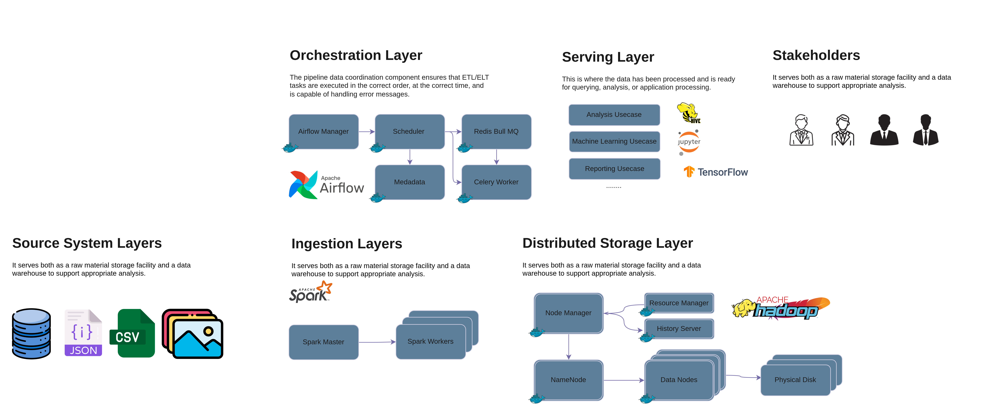
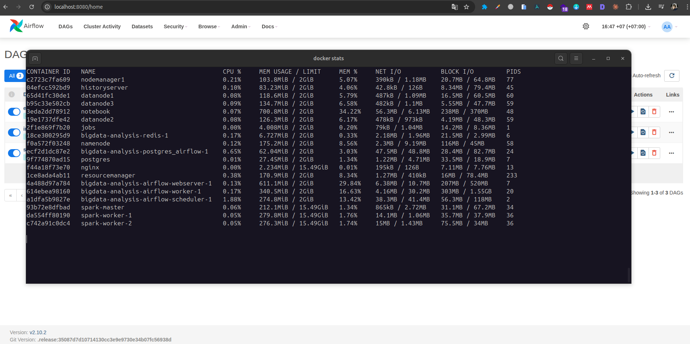
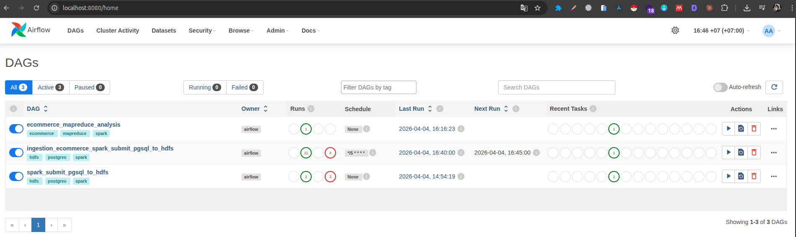
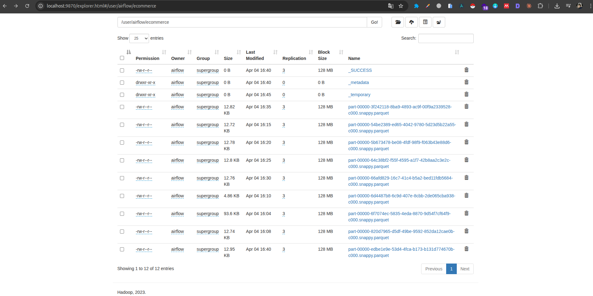
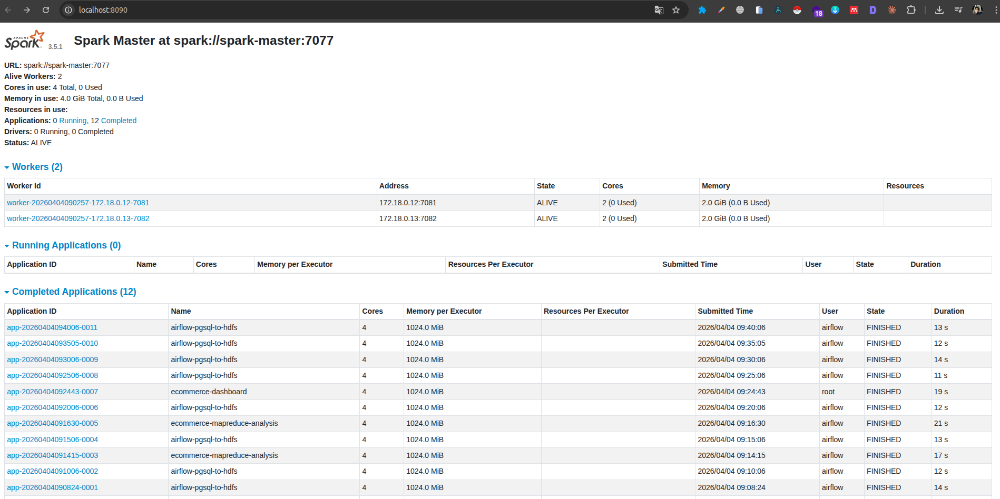
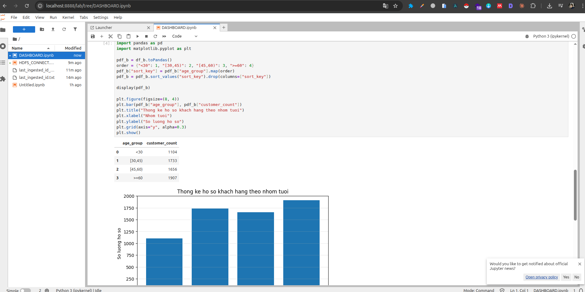

# Hadoop + Spark Multinode (Docker Compose)

This folder provides a Docker Compose setup for a Hadoop 3.3.6 multinode cluster with YARN, plus a local Spark 3.5.1 standalone cluster and a Jupyter notebook container for development.

# Architecture (High Level, Simple)


https://app.diagrams.net/#G158eUqwWUwa0m3VcTRqD9KRHQy1pDmX3n#%7B%22pageId%22%3A%22WtucqDReYDAVf_n9q3lc%22%7D

## Prerequisites

- Docker and Docker Compose
- 8+ GB RAM available for containers

## Quick Start

```bash
docker compose up -d
docker compose ps
docker compose logs -f
```

## Services and Ports

- NameNode UI: `http://localhost:9870`
- ResourceManager UI: `http://localhost:8089`
- HistoryServer UI: `http://localhost:8188`
- NodeManager UI: `http://localhost:8042`
- DataNode UIs: `http://localhost:9864`, `http://localhost:9865`, `http://localhost:9866`
- Spark Master UI: `http://localhost:8090`
- Spark Worker UIs: `http://localhost:8091`, `http://localhost:8092`
- Spark Master RPC: `spark://localhost:7077`
- Jupyter: `http://localhost:8888`
- Minio amdin: `http://localhost:9001` (username: `minioadmin`, password: `minioadmin`)

## Screenshots

### Cluster Overview



### Airflow



### NodeManager



### Spark Master



### Data Analysis


