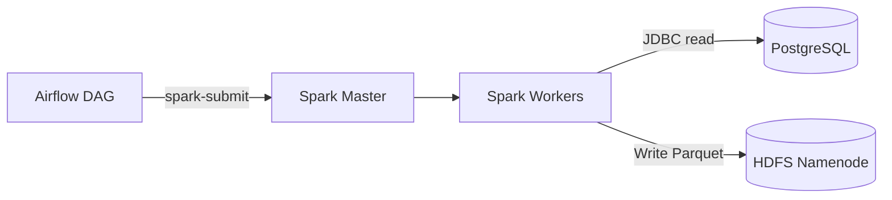

# Airflow -> Spark -> HDFS (nguồn Postgres)

Thư mục này chạy một stack Airflow riêng, có thể `spark-submit` job vào cụm Spark và ghi kết quả ra HDFS.

## Yêu Cầu
- Docker và Docker Compose
- Stack Hadoop/Spark chính ở `hadoop-environment/docker-compose.yml`

## Khởi Chạy Nhanh
1. Bật stack Hadoop/Spark (tạo `hadoop_network`):
   ```bash
   docker compose -f hadoop-environment/docker-compose.yml up -d
   ```
2. Build và chạy Airflow:
   ```bash
   docker compose -f hadoop-environment/airflow/docker-compose.yaml up -d --build
   ```
3. Mở Airflow UI:
   - `http://localhost:8080`
   - Tài khoản mặc định: `airflow / airflow`

## Thành Phần Có Sẵn
- Image Airflow có Java + PySpark để chạy `spark-submit`.
- DAG ở `./airflow/dags/`
- App Spark mẫu ở `./airflow/apps/`
- Dùng chung network `hadoop_network` để truy cập `spark-master` và `namenode`.

## Luồng Pipeline Ví Dụ
1. Airflow trigger job Spark bằng `spark-submit`.
2. Spark đọc dữ liệu từ PostgreSQL qua JDBC.
3. Spark ghi output ra HDFS (`hdfs://namenode:8020/...`).

## Sơ Đồ Workflow (Mermaid)


## Đặt Code Ở Đâu
- DAG: `hadoop-environment/airflow/airflow/dags/`
- App Spark (PySpark): `hadoop-environment/airflow/airflow/apps/`

## Phát Triển 1 Job (Từng Bước)
1. Tạo PySpark app trong `hadoop-environment/airflow/airflow/apps/`.
   - Ví dụ: `hadoop-environment/airflow/airflow/apps/pgsql_to_hdfs.py`
2. Đảm bảo app đọc config từ env:
   - `POSTGRES_HOST`, `POSTGRES_PORT`, `POSTGRES_DB`, `POSTGRES_USER`, `POSTGRES_PASSWORD`
   - `CLICKSTREAM_TABLE`
   - `HDFS_OUTPUT_PATH` (mặc định: `hdfs://namenode:8020/user/airflow/clickstream`)
3. Tạo DAG trong `hadoop-environment/airflow/airflow/dags/` để chạy `spark-submit`.
   - Ví dụ: `hadoop-environment/airflow/airflow/dags/spark_submit_pgsql_to_hdfs.py`
4. Rebuild Airflow để cài code và dependency mới:
   ```bash
   docker compose -f hadoop-environment/airflow/docker-compose.yaml up -d --build
   ```
5. Trigger DAG trên Airflow UI.

## DAG Mẫu
Có sẵn DAG mẫu submit một PySpark app:
- `hadoop-environment/airflow/airflow/dags/spark_submit_wordcount.py`

Lệnh gọi:
```bash
spark-submit --master spark://spark-master:7077 /opt/airflow/apps/wordcount.py
```

## DAG Postgres -> HDFS
Có DAG đọc từ Postgres và ghi ra HDFS:
- `hadoop-environment/airflow/airflow/dags/spark_submit_pgsql_to_hdfs.py`

Lệnh gọi:
```bash
spark-submit --master spark://spark-master:7077 \
  --jars /opt/airflow/jars/postgresql-42.7.3.jar \
  /opt/airflow/apps/pgsql_to_hdfs.py
```

Đường dẫn output mặc định:
- `hdfs://namenode:8020/user/airflow/clickstream`

## Triển Khai Trên Hệ Thống Hiện Tại
1. Bật Hadoop/Spark (tạo `hadoop_network`):
   ```bash
   docker compose -f hadoop-environment/docker-compose.yml up -d
   ```
2. Bật job generator Postgres (khuyến nghị):
   ```bash
   docker compose -f hadoop-environment/docker-compose.yml up -d jobs
   ```
3. Build và chạy Airflow:
   ```bash
   docker compose -f hadoop-environment/airflow/docker-compose.yaml up -d --build
   ```
4. Mở Airflow và chạy DAG:
   - `http://localhost:8080` (đăng nhập `airflow / airflow`)
5. Kiểm tra dữ liệu trên HDFS:
   ```bash
   docker exec namenode hdfs dfs -ls /user/airflow/clickstream
   ```

## Ghi Chú
- Nếu bị lỗi permission khi mount volume:
  ```bash
  chmod -R 777 /airflow
  ```
- Airflow dùng `../.env` cho cấu hình Spark/Postgres.
- Ví dụ output HDFS: `hdfs://namenode:8020/user/airflow/...`

## Bước Tiếp Theo
- Viết PySpark job mới để đọc Postgres và ghi ra HDFS.
- Thêm DAG gọi job đó bằng `spark-submit`.


sudo chown -R 50000:0 hadoop-environment/airflow/airflow