# Định nghĩa dữ liệu nguồn cho mock service (Customer Churn)

## 1) Mục tiêu
Tài liệu này định nghĩa bộ dữ liệu nguồn để mô phỏng hành vi mua hàng của khách hàng, phục vụ chạy data pipeline và huấn luyện mô hình dự đoán churn.

Phạm vi tập trung vào dữ liệu mua hàng, có bổ sung dữ liệu thanh toán và nhãn churn để bài toán thực tế hơn.

## 2) Mô hình dữ liệu cốt lõi

### 2.1 `customers` (dimension)
| Trường | Kiểu | Bắt buộc | Mô tả |
|---|---|---|---|
| customer_id | STRING | Có | Định danh khách hàng, ví dụ `CUST_000001` |
| signup_date | DATE | Có | Ngày đăng ký |
| birth_year | INT | Không | Năm sinh (1970-2005) |
| gender | STRING | Không | `male`, `female`, `other`, `unknown` |
| city | STRING | Có | Thành phố |
| acquisition_channel | STRING | Có | `ads`, `organic`, `referral`, `social` |
| segment | STRING | Có | `new`, `regular`, `vip` |
| is_active | BOOLEAN | Có | Trạng thái hiện tại |

Khóa chính: `customer_id`

### 2.2 `orders` (fact)
| Trường | Kiểu | Bắt buộc | Mô tả |
|---|---|---|---|
| order_id | STRING | Có | Định danh đơn hàng, ví dụ `ORD_20260411_000001` |
| customer_id | STRING | Có | FK sang `customers.customer_id` |
| order_ts | TIMESTAMP | Có | Thời điểm tạo đơn |
| order_status | STRING | Có | `completed`, `cancelled`, `returned` |
| currency | STRING | Có | Mặc định `VND` |
| subtotal_amount | DECIMAL(18,2) | Có | Tổng tiền hàng trước giảm giá |
| discount_amount | DECIMAL(18,2) | Có | Tổng giảm giá |
| shipping_fee | DECIMAL(18,2) | Có | Phí vận chuyển |
| tax_amount | DECIMAL(18,2) | Có | Thuế |
| total_amount | DECIMAL(18,2) | Có | `subtotal - discount + shipping + tax` |
| payment_method | STRING | Có | `cod`, `bank_transfer`, `card`, `ewallet` |
| promo_code | STRING | Không | Mã khuyến mãi |

Khóa chính: `order_id`

### 2.3 `order_items` (fact)
| Trường | Kiểu | Bắt buộc | Mô tả |
|---|---|---|---|
| order_item_id | STRING | Có | Định danh dòng sản phẩm |
| order_id | STRING | Có | FK sang `orders.order_id` |
| product_id | STRING | Có | Định danh sản phẩm |
| category | STRING | Có | `electronics`, `fashion`, `grocery`, `home`, `beauty` |
| unit_price | DECIMAL(18,2) | Có | Đơn giá |
| quantity | INT | Có | Số lượng, >= 1 |
| line_discount | DECIMAL(18,2) | Có | Giảm giá dòng |
| line_amount | DECIMAL(18,2) | Có | `(unit_price * quantity) - line_discount` |

Khóa chính: `order_item_id`

### 2.4 `payments` (fact)
| Trường | Kiểu | Bắt buộc | Mô tả |
|---|---|---|---|
| payment_id | STRING | Có | Định danh giao dịch thanh toán |
| order_id | STRING | Có | FK sang `orders.order_id` |
| customer_id | STRING | Có | FK sang `customers.customer_id` |
| payment_ts | TIMESTAMP | Có | Thời điểm thanh toán |
| payment_status | STRING | Có | `success`, `failed`, `pending`, `refunded` |
| paid_amount | DECIMAL(18,2) | Có | Số tiền thanh toán |
| failure_reason | STRING | Không | Lý do thất bại |

Khóa chính: `payment_id`

### 2.5 `churn_labels` (training target)
| Trường | Kiểu | Bắt buộc | Mô tả |
|---|---|---|---|
| snapshot_date | DATE | Có | Ngày chụp dữ liệu |
| customer_id | STRING | Có | FK sang `customers.customer_id` |
| churn_30d | INT | Có | 1 nếu khách rời bỏ trong 30 ngày sau snapshot, ngược lại 0 |
| churn_reason | STRING | Không | `price`, `service_quality`, `payment_issue`, `inactive` |

Khóa chính tổng hợp: (`snapshot_date`, `customer_id`)

## 3) Quy tắc chất lượng và quan hệ dữ liệu
- Mỗi bản ghi `orders` phải có `customer_id` tồn tại trong `customers`.
- Mỗi `order_id` trong `order_items` và `payments` phải tồn tại trong `orders`.
- `total_amount` của `orders` phải bằng công thức đã định nghĩa (sai số <= 1 VND).
- `paid_amount` không vượt quá `total_amount` nếu không phải trạng thái `refunded`.
- Tỷ lệ thiếu dữ liệu khuyến nghị:
  - `promo_code`: 60% null.
  - `birth_year`: 10% null.
  - `failure_reason`: chỉ có giá trị khi `payment_status = failed`.

## 4) Phân phối dữ liệu gợi ý cho mock
- Quy mô ban đầu:
  - 100,000 khách hàng.
  - 2,000,000 đơn hàng cho 12 tháng.
- Trung bình đơn hàng: 1.2 item/đơn.
- Giá trị đơn hàng (AOV): 150,000 - 1,200,000 VND (phân phối lệch phải).
- Tỷ lệ trạng thái đơn:
  - `completed`: 92%
  - `cancelled`: 5%
  - `returned`: 3%
- Tỷ lệ thanh toán thất bại: 4%.
- Tỷ lệ churn trung bình: 12-18% (mô hình dễ học hơn nếu có tín hiệu rõ).

## 5) Logic sinh dữ liệu liên quan churn
Để mô hình học được, nên chủ động cài tín hiệu churn:
- Khách có nguy cơ churn cao thường có:
  - Không phát sinh đơn trong 45-60 ngày gần nhất.
  - Tần suất mua giảm mạnh 2 tháng liên tiếp.
  - Tỷ lệ thanh toán thất bại tăng.
  - Giá trị đơn trung bình giảm.
- Khách churn (`churn_30d = 1`) nên có ít nhất 2-3 tín hiệu trong các tín hiệu trên.

## 6) Định dạng dữ liệu xuất ra cho pipeline

### 6.1 Batch file (khuyến nghị)
- Định dạng: Parquet (ưu tiên) hoặc CSV.
- Partition:
  - `orders`: theo `order_date=YYYY-MM-DD`
  - `payments`: theo `payment_date=YYYY-MM-DD`
  - `churn_labels`: theo `snapshot_date=YYYY-MM-DD`

Ví dụ đường dẫn:
- `/data/raw/orders/order_date=2026-04-11/part-0001.parquet`
- `/data/raw/order_items/order_date=2026-04-11/part-0001.parquet`
- `/data/raw/payments/payment_date=2026-04-11/part-0001.parquet`

### 6.2 Streaming event (nếu cần)
Topic: `purchase_events`

Payload JSON:
```json
{
  "event_id": "EVT_20260411_000001",
  "event_ts": "2026-04-11T08:10:20Z",
  "event_type": "order_completed",
  "customer_id": "CUST_000123",
  "order_id": "ORD_20260411_000456",
  "total_amount": 459000,
  "payment_method": "ewallet",
  "order_status": "completed",
  "city": "Ho Chi Minh"
}
```

## 7) API contract cho mock application

### 7.1 Sinh dữ liệu
`POST /mock/generate`

Request:
```json
{
  "from_date": "2025-01-01",
  "to_date": "2026-03-31",
  "num_customers": 100000,
  "avg_orders_per_customer": 20,
  "base_churn_rate": 0.15,
  "output_format": "parquet",
  "output_path": "/data/raw"
}
```

Response:
```json
{
  "job_id": "GEN_20260411_001",
  "status": "accepted"
}
```

### 7.2 Trạng thái job
`GET /mock/generate/{job_id}`

Response:
```json
{
  "job_id": "GEN_20260411_001",
  "status": "completed",
  "rows": {
    "customers": 100000,
    "orders": 1998765,
    "order_items": 2401023,
    "payments": 1998765,
    "churn_labels": 100000
  },
  "output_path": "/data/raw"
}
```

## 8) Bộ trường tối thiểu nếu bạn muốn làm nhanh (MVP)
Nếu cần chạy pipeline sớm, chỉ cần 3 bảng trước:
- `customers(customer_id, signup_date, city, segment)`
- `orders(order_id, customer_id, order_ts, total_amount, order_status, payment_method)`
- `churn_labels(snapshot_date, customer_id, churn_30d)`

Sau khi chạy ổn định, bổ sung `order_items` và `payments` để tăng độ thực tế.

## 9) Mermaid pipeline (end-to-end)

```mermaid
flowchart LR
    A[Mock Application<br/>Sinh dữ liệu customers/orders/order_items/payments] --> B[Kafka Topics<br/>purchase_events/payment_events]
    A --> C[Batch Files<br/>Parquet/CSV theo ngày]

    B --> D[Ingestion Job<br/>Spark/Flink Consumer]
    C --> E[ETL Batch Job<br/>Airflow + Spark]

    D --> F[HDFS Raw Zone]
    E --> F

    F --> G[Hive External Tables<br/>raw.customers/raw.orders/raw.payments]
    G --> H[Curated Layer<br/>cleaned + chuẩn hóa + partition]
    H --> I[Feature Layer<br/>customer_features_daily]

    I --> J[Training Dataset<br/>churn_training_dataset]
    J --> K[Model Training<br/>Spark ML / XGBoost]
    K --> L[Model Registry]

    L --> M[Daily Scoring Job]
    I --> M
    M --> N[Churn Scores Table<br/>customer_churn_score_daily]

    N --> O[CRM/Campaign Service<br/>Ưu tiên giữ chân]
    N --> P[BI Dashboard<br/>churn rate, uplift, ROI]
```

