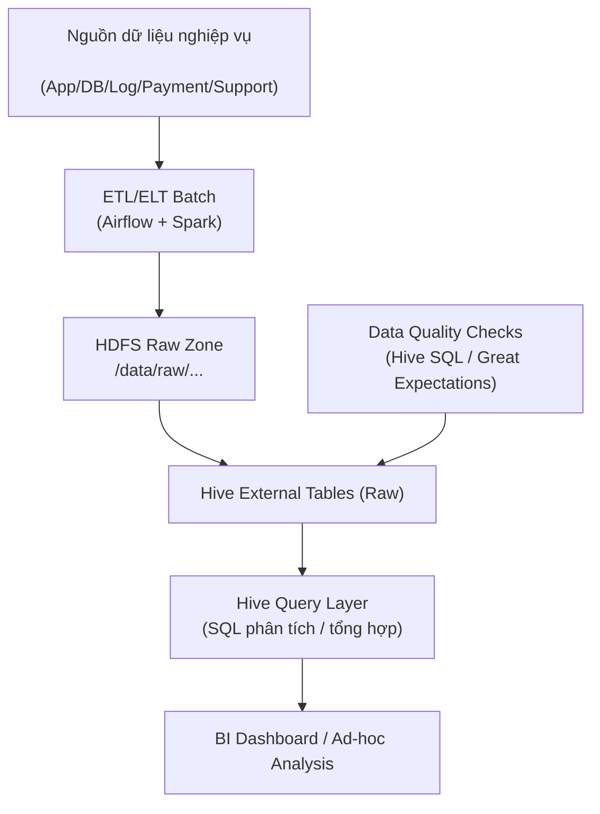

```mermaid
flowchart TB
    A["Nguồn dữ liệu nghiệp vụ
    (App/DB/Log/Payment/Support)"] --> B["ETL/ELT Batch
    (Airflow + Spark)"]
    B --> C["HDFS Raw Zone
    /data/raw/..."]

    C --> D["Hive External Tables (Raw)"]
    D --> E["Hive Query Layer
    (SQL phân tích / tổng hợp)"]
    E --> F["BI Dashboard / Ad-hoc Analysis"]

    O["Data Quality Checks
    (Hive SQL / Great Expectations)"] --> D

```
