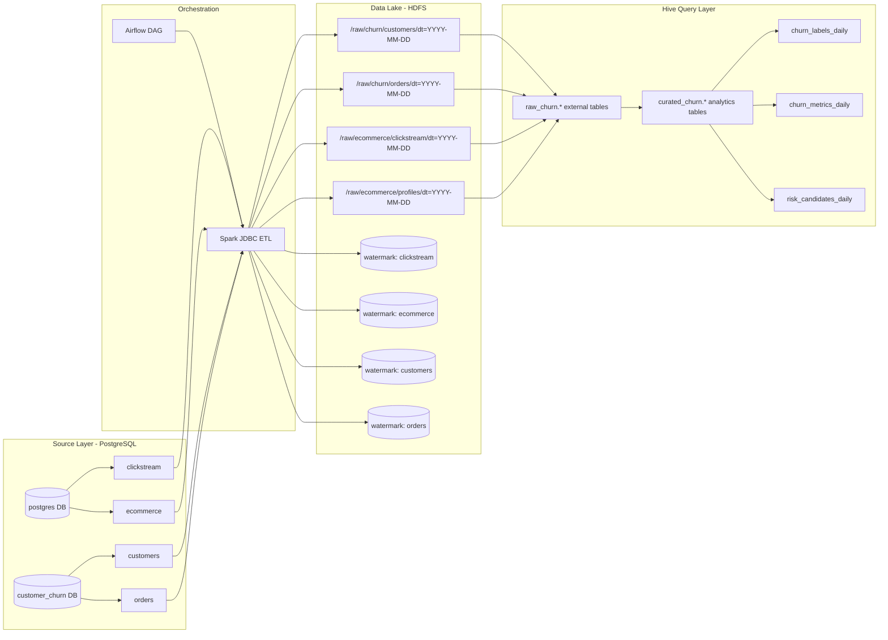

# ETL Design - Customer Churn (Current State)

## 1) Scope hiện tại

Thiết kế này bám theo trạng thái đang chạy:

- Source simulator đang ghi song song:
  - DB `postgres`: `clickstream`, `ecommerce`
  - DB `customer_churn`: `customers`, `orders`
- Chưa generate `churn_labels` ở simulator.
- `churn_labels` sẽ được tính ở Hive query layer.

## 2) Mermaid ETL Flow



## 3) ETL layers và convention

### 3.1 Raw layer (HDFS)

- Định dạng: Parquet
- Partition chuẩn: `dt` (ingestion date)
- Đường dẫn đề xuất:
  - `hdfs://namenode:8020/data/raw/churn/customers/dt=YYYY-MM-DD`
  - `hdfs://namenode:8020/data/raw/churn/orders/dt=YYYY-MM-DD`

### 3.2 Hive databases

- `raw_churn`: external tables trỏ thẳng raw Parquet trên HDFS
- `curated_churn`: bảng/view đã chuẩn hóa để query churn

### 3.3 Incremental strategy

- `orders`: incremental theo `id` hoặc `order_ts` (khuyến nghị `id` nếu monotonic)
- `customers`: snapshot theo chu kỳ (overwrite partition `dt`)
- Watermark lưu ở HDFS metadata path theo từng table

## 4) Destination schemas for Hive

## 4.1 Raw schemas (external)

```sql
CREATE DATABASE IF NOT EXISTS raw_churn;

CREATE EXTERNAL TABLE IF NOT EXISTS raw_churn.customers_raw (
  customer_id STRING,
  signup_date DATE,
  birth_year INT,
  gender STRING,
  city STRING,
  acquisition_channel STRING,
  segment STRING,
  is_active BOOLEAN
)
PARTITIONED BY (dt STRING)
STORED AS PARQUET
LOCATION 'hdfs://namenode:8020/data/raw/churn/customers';

CREATE EXTERNAL TABLE IF NOT EXISTS raw_churn.orders_raw (
  order_id STRING,
  customer_id STRING,
  order_ts TIMESTAMP,
  order_status STRING,
  currency STRING,
  subtotal_amount DECIMAL(18,2),
  discount_amount DECIMAL(18,2),
  shipping_fee DECIMAL(18,2),
  tax_amount DECIMAL(18,2),
  total_amount DECIMAL(18,2),
  payment_method STRING,
  promo_code STRING
)
PARTITIONED BY (dt STRING)
STORED AS PARQUET
LOCATION 'hdfs://namenode:8020/data/raw/churn/orders';
```

## 4.2 Curated schemas for churn query

```sql
CREATE DATABASE IF NOT EXISTS curated_churn;

CREATE TABLE IF NOT EXISTS curated_churn.customer_features_daily (
  customer_id STRING,
  segment STRING,
  city STRING,
  acquisition_channel STRING,
  is_active BOOLEAN,
  recency_days INT,
  orders_30d INT,
  orders_60d INT,
  amount_30d DECIMAL(18,2),
  amount_60d DECIMAL(18,2),
  avg_order_value_30d DECIMAL(18,2),
  avg_order_value_60d DECIMAL(18,2)
)
PARTITIONED BY (snapshot_date)
STORED AS PARQUET;

CREATE TABLE IF NOT EXISTS curated_churn.churn_labels_daily (
  customer_id STRING,
  churn_30d INT,
  churn_reason STRING
)
PARTITIONED BY (snapshot_date)
STORED AS PARQUET;

CREATE TABLE IF NOT EXISTS curated_churn.churn_metrics_daily (
  segment STRING,
  city STRING,
  acquisition_channel STRING,
  customers_cnt BIGINT,
  churn_cnt BIGINT,
  churn_rate DECIMAL(8,4)
)
PARTITIONED BY (snapshot_date)
STORED AS PARQUET;

CREATE TABLE IF NOT EXISTS curated_churn.risk_candidates_daily (
  customer_id STRING,
  risk_tier STRING,
  risk_score DOUBLE,
  reason_code STRING,
  recency_days INT,
  orders_30d INT,
  amount_30d DECIMAL(18,2)
)
PARTITIONED BY (snapshot_date)
STORED AS PARQUET;
```

## 5) Rule gợi ý để derive churn_labels ở Hive

Rule MVP (deterministic):

- `churn_30d = 1` nếu tại `snapshot_date` khách không có đơn trong 30 ngày gần nhất.
- `churn_reason`:
  - `inactive` nếu `recency_days >= 30`
  - `low_frequency` nếu `orders_30d = 0` và `orders_60d > 0`
  - `value_drop` nếu `avg_order_value_30d < 0.7 * avg_order_value_60d`

Có thể bắt đầu rule-based, sau đó thay bằng model scoring sau.

## 6) Definition of Done cho ETL stage

- DAG ingestion ghi được `customers_raw` và `orders_raw` partition theo `dt`.
- Hive đọc được external tables `raw_churn.customers_raw`, `raw_churn.orders_raw`.
- Hive tạo được `customer_features_daily` và `churn_labels_daily` theo lịch.
- Có bảng metrics cho BI: `churn_metrics_daily`.
