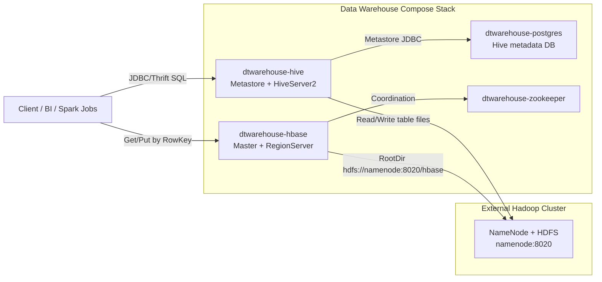
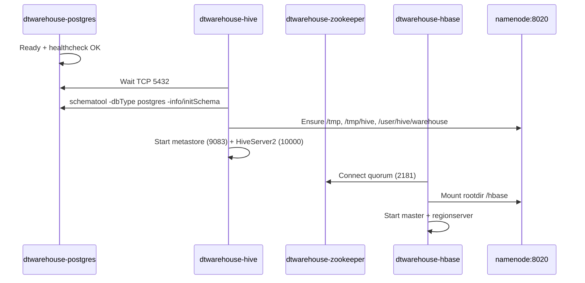
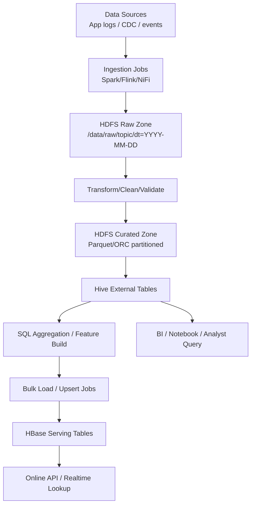

# Low-Level Design: Hive + HBase (Data Warehouse Layer)

Tài liệu này mô tả thiết kế chi tiết mức triển khai (LLD) cho stack trong `data_warehouse/` để bạn dễ hiểu:
1. Architecture
2. Use case
3. Workflow thu thập và phục vụ dữ liệu

## 1) Architecture (LLD)

### 1.1 Thành phần chính

| Component | Container | Vai trò | Port chính |
|---|---|---|---|
| Hive Metastore + HiveServer2 | `dtwarehouse-hive` | Quản lý metadata bảng Hive, chạy SQL query | `9083`, `10000`, `10002` |
| PostgreSQL | `dtwarehouse-postgres` | Lưu metadata cho Hive metastore | `5433` host -> `5432` container |
| HBase Master + RegionServer | `dtwarehouse-hbase` | Lưu dữ liệu NoSQL truy cập nhanh theo key | `16000`, `16010` |
| ZooKeeper | `dtwarehouse-zookeeper` | Điều phối và service discovery cho HBase | `2181` |
| External Hadoop Cluster | `namenode:8020` | Lớp lưu trữ HDFS dùng chung | `8020` |

### 1.2 Sơ đồ kết nối runtime

### 1.3 Luồng khởi động service

## 2) Use Case phù hợp

### 2.1 Hive (batch analytics / SQL)
- Query dữ liệu lớn trên HDFS bằng SQL (reporting, ad-hoc analysis).
- Tạo bảng external/managed và partition theo ngày/giờ.
- ETL tổng hợp (fact/dimension) cho dashboard BI.

### 2.2 HBase (low-latency serving)
- Tra cứu hồ sơ theo `rowkey` với độ trễ thấp.
- Lưu dữ liệu time-series/behavior dạng sparse wide-table.
- Dùng cho API cần đọc nhanh dữ liệu đã chuẩn hóa từ pipeline.

### 2.3 Khi dùng cả Hive + HBase
- Hive xử lý batch và tính toán dữ liệu nặng.
- Kết quả phục vụ online (lookup nhanh) được đẩy sang HBase.
- Mô hình chuẩn: `HDFS raw -> Hive curated -> HBase serving`.

## 3) Workflow thu thập dữ liệu (collect data)

Giả sử có nguồn log/app events đổ vào data lake theo ngày.

### 3.1 Checklist triển khai pipeline

1. Ingest dữ liệu vào HDFS raw theo partition thời gian (`dt`, `hh`).
2. Chuẩn hóa schema, xử lý null/duplicate, ghi curated zone (Parquet/ORC).
3. Tạo/refresh Hive external table trỏ vào curated path.
4. Chạy job aggregate theo SLA (hourly/daily).
5. Upsert kết quả quan trọng sang HBase theo thiết kế `rowkey`.
6. Expose:
   - SQL analytics qua HiveServer2.
   - Lookup độ trễ thấp qua HBase API layer.

## 4) Thiết kế key và schema gợi ý

### 4.1 Hive table
- Partition theo `dt` (bắt buộc), có thể thêm `country`, `source`.
- Định dạng `Parquet`/`ORC` để giảm scan.
- Tránh nhiều file nhỏ, nên compact theo batch window.

### 4.2 HBase table
- RowKey có prefix phân bố đều tải (tránh hotspot).
- Column family ít và ổn định (vd: `f`, `m`).
- TTL cho dữ liệu ngắn hạn, versioning khi cần audit lịch sử.

## 5) Mapping nhanh: nhu cầu -> công nghệ

| Nhu cầu | Dùng gì |
|---|---|
| SQL analytics trên dữ liệu lớn lịch sử | Hive |
| Truy vấn theo key < 100ms | HBase |
| Báo cáo theo ngày/tuần/tháng | Hive |
| Serving cho API lookup realtime | HBase |
| Pipeline lakehouse đơn giản | Hive + HDFS |
| Batch compute + online serve | Hive + HBase |

## 6) Operational notes

- Stack này tối ưu local/dev, chưa phải production HA.
- Metadata Hive được lưu ở PostgreSQL (`dtwarehouse-postgres`).
- HBase dùng ZooKeeper ngoài (`dtwarehouse-zookeeper`), không chạy ZK embedded.
- Cần đảm bảo `hadoop_network` và `namenode` từ cluster chính luôn reachable.
