# Data Warehouse Layer (Hive + HBase)

This module adds two Docker images for the warehouse/query layer:
- `data-warehouse-hive:3.1.3`
- `data-warehouse-hbase:2.4.17`

Detailed design: see [LOW_LEVEL_DESIGN.md](./LOW_LEVEL_DESIGN.md).

## Folder Structure

```text
data_warehouse/
├── docker-compose.yml
├── hive/
│   ├── Dockerfile
│   ├── hive-site.xml
│   └── start-hive.sh
└── hbase/
    ├── Dockerfile
    ├── hbase-site.xml
    └── start-hbase.sh
```

## Build and Run

From project root:

```bash
mkdir -p volumes/hive/warehouse volumes/hbase volumes/dtwarehouse-postgres
cd data_warehouse
docker compose build
docker compose up -d
```

## Architecture

```mermaid
flowchart TD
    HC["Existing Hadoop Cluster<br/>- NameNode: namenode:8020<br/>- HDFS storage layer"]

    HIVE["Hive Container<br/>image: data-warehouse-hive:3.1.3<br/><br/>Services:<br/>- Metastore: 9083<br/>- HiveServer2: 10000<br/>- Hive UI: 10002"]
    PG["PostgreSQL Container<br/>image: postgres:15<br/>- Metastore DB: 5432 (container) / 5433 (host)"]
    ZK["ZooKeeper Container<br/>image: zookeeper:3.8<br/>- Client port: 2181"]
    HBASE["HBase Container<br/>image: data-warehouse-hbase:2.4.17<br/><br/>Services:<br/>- HBase Master: 16000<br/>- HBase UI: 16010"]

    VHIVE["volumes/hive/warehouse"]
    VHBASE["volumes/hbase"]
    VPG["volumes/dtwarehouse-postgres"]

    HIVE -->|metastore JDBC| PG
    HC -->|hadoop_network| HIVE
    HC -->|hadoop_network| HBASE
    HBASE -->|ZooKeeper quorum| ZK

    HIVE -->|local volumes| VHIVE
    HBASE -->|local volumes| VHBASE
    PG -->|local volumes| VPG
```



## Service Role

- Hive:
  - SQL query engine over HDFS data.
  - Runs metastore + HiveServer2 in one container.
  - Metastore metadata is stored in PostgreSQL.
  - Suitable for development/testing.
- HBase:
  - NoSQL low-latency store for random read/write workloads.
  - Uses `hdfs://namenode:8020/hbase` as root directory.
  - Uses external ZooKeeper service for coordination.

## Ports

- Hive:
  - `10000` HiveServer2
  - `10002` Hive web UI
  - `9083` Metastore thrift
- HBase:
  - `16010` HBase master UI
  - `16000` HBase master RPC
- ZooKeeper:
  - `2181` ZooKeeper client
- PostgreSQL:
  - `5433` host -> `5432` container (Metastore database)

## Notes

- `data_warehouse/docker-compose.yml` uses external network `hadoop_network`.
- Make sure your main cluster stack is running so `namenode` is reachable.
- This setup is optimized for local/dev use, not production HA.
