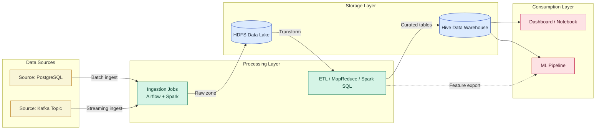

# Big Picture Data Architecture

```mermaid

flowchart LR
	%% ===== Nodes =====
	SRC1[Source: PostgreSQL]
	SRC2[Source: Kafka Topic]
	ING[Ingestion Jobs\nAirflow + Spark]
	HDFS[(HDFS Data Lake)]
	ETL[ETL / MapReduce / Spark SQL]
	DW[(Hive Data Warehouse)]
	BI[Dashboard / Notebook]
	ML[ML Pipeline]

	%% ===== Subgraphs =====
	subgraph L1[Data Sources]
		SRC1
		SRC2
	end

	subgraph L2[Processing Layer]
		ING
		ETL
	end

	subgraph L3[Storage Layer]
		HDFS
		DW
	end

	subgraph L4[Consumption Layer]
		BI
		ML
	end

	%% ===== Links =====
	SRC1 -->|Batch ingest| ING
	SRC2 -->|Streaming ingest| ING
	ING -->|Raw zone| HDFS
	HDFS -->|Transform| ETL
	ETL -->|Curated tables| DW
	DW --> BI
	DW --> ML

	%% ===== Optional alternate path =====
	ETL -.->|Feature export| ML

	%% ===== Styles =====
	classDef source fill:#f9f5d7,stroke:#b57614,stroke-width:1px,color:#3c3836;
	classDef process fill:#d5f4e6,stroke:#1b7f5c,stroke-width:1px,color:#0b3d2e;
	classDef storage fill:#dbeafe,stroke:#1e40af,stroke-width:1px,color:#1e293b;
	classDef consume fill:#fde2e4,stroke:#be123c,stroke-width:1px,color:#4a1022;

	class SRC1,SRC2 source;
	class ING,ETL process;
	class HDFS,DW storage;
	class BI,ML consume;
```
