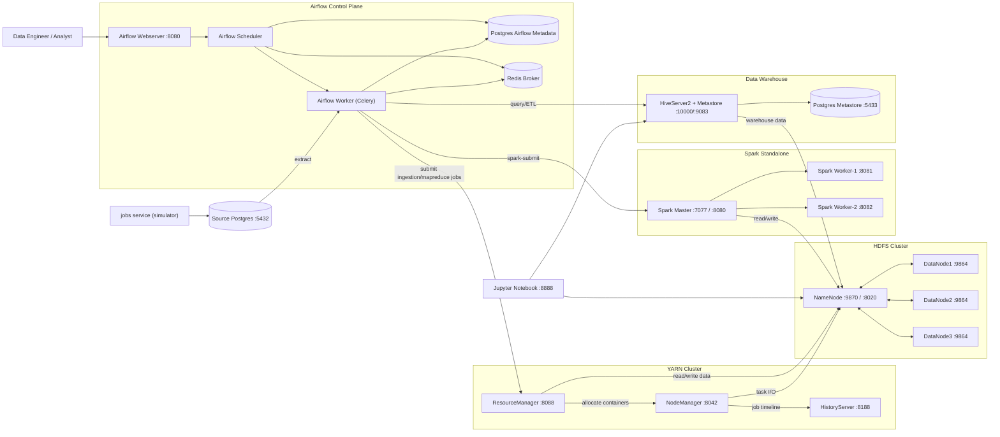

# YARN System Architecture

## Overall architecture (from current docker-compose)

## YARN-focused responsibilities

- `ResourceManager`: nhận job request, lập lịch tài nguyên và phân phối container.
- `NodeManager`: chạy container/task thực thi trên node worker.
- `HistoryServer`: lưu và tra cứu lịch sử job (timeline/logical history).
- `NameNode/DataNode`: lớp lưu trữ dữ liệu HDFS phục vụ input/output cho YARN jobs.

## Typical execution flow (YARN path)

1. Airflow Scheduler kích hoạt DAG.
2. Airflow Worker submit job (MapReduce hoặc Spark client flow) vào cụm Hadoop.
3. ResourceManager cấp container cho NodeManager.
4. Task đọc dữ liệu từ HDFS (NameNode/DataNode), xử lý, ghi kết quả về HDFS.
5. Trạng thái và lịch sử job được theo dõi qua ResourceManager UI / HistoryServer.

