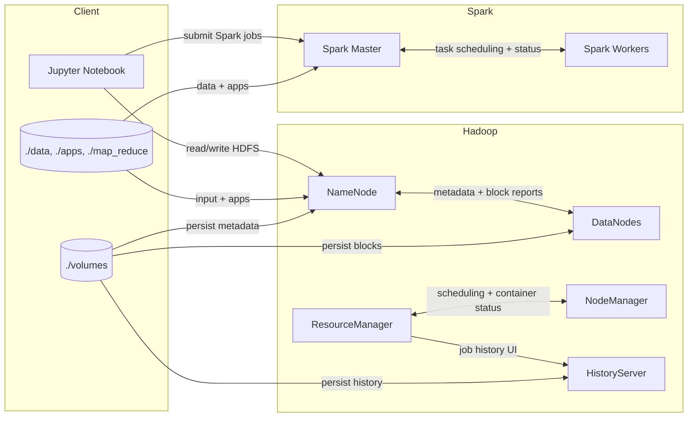

# Architecture (High Level, Simple)

```mermaid
flowchart LR
  subgraph Hadoop
    NN[NameNode] <--> |metadata + block reports| DN[DataNodes]
    RM[ResourceManager] <--> |scheduling + container status| NM[NodeManager]
    RM --> |job history UI| HS[HistoryServer]
  end

  subgraph Spark
    SM[Spark Master] <--> |task scheduling + status| SW[Spark Workers]
  end

  subgraph Client
    NB[Jupyter Notebook]
    D[(./data, ./apps, ./map_reduce)]
    V[(./volumes)]
  end

  NB --> |submit Spark jobs| SM
  NB --> |read/write HDFS| NN

  D --> |input + apps| NN
  D --> |data + apps| SM

  V --> |persist metadata| NN
  V --> |persist blocks| DN
  V --> |persist history| HS
```
