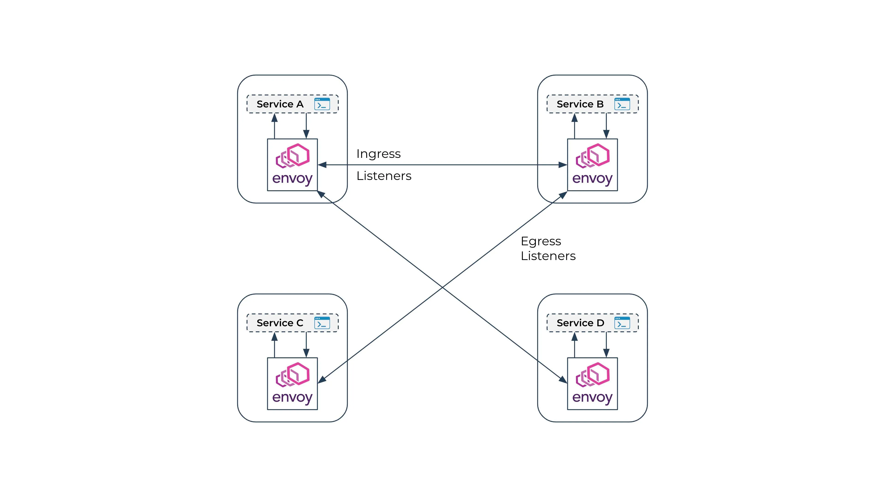

# Problem:
Trong bối cảnh một distributed system:

- một kết nối từ service A service B khác để lấy thông tin bị chậm, hệ thống sẽ retry x lần, tương tự theo chiều ngược lại, với 1000 user thì việc này thưc hiện 1000\*x lần đẫn đến hệ thống đã chậm lại càng thêm chậm, thậm chí có thể bị overload và crash hệ thống.

- làm thế nào để biết dược request đang failure ở đâu chậm ở đâu, ở node nào đang bị ngẽn?

- Mooiz team có cơ chế retry, hadnle errỏ, loadbalacning khác nhau, khó đoán và điều này lặp lại khắp nơi trong hệ thống
Vấn đề thực tế

- Các service nội nộ gọi qua nhau mà khogn hề cơ cơ chế bảo mật, một idịch vụ bị vấn đề có thể ảnh hưởng đên các dịch vụ khác, như bị nghe lén, bị thay đổi dữ liệum,...

> Cross-cutting concerns - concern xuất hiện ở mọi service\

> Main proble,: “Networking logic đang nằm trong application”


# Solution:
Đem đóng logisc liên quan đến network ra motjt hành phần riêng,
- Đảm bảo bảo mật, retry, điều phooeis requeyst, và các cơ chế khác.
- Service khoogn cần quan tập các nghiệp vụ của network nửa.



# Implementation:

What is envoy

```mermaid

```

# Ref

- https://www.solo.io/topics/omni/envoy-proxy
-https://github.com/viggnah/envoy-examples/blob/main/microsvc/mainapp-flask/requirements.txt
